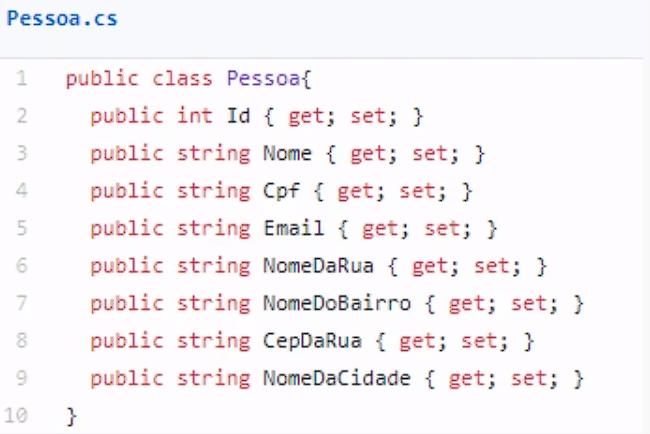
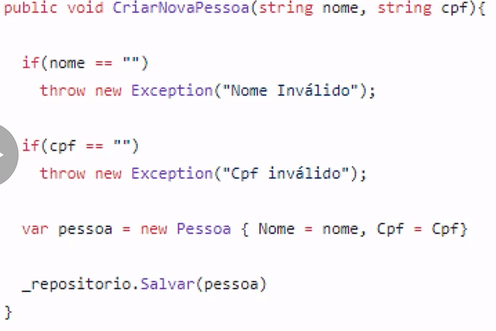
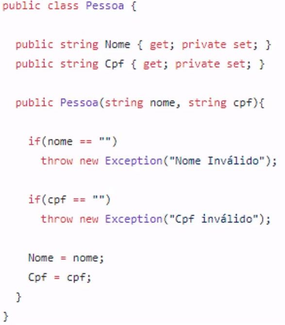

- **Domain Experts:**
    1. Uma pessoa ou um grupo de pessoas.
    2. Entende de um determinado negócio da empresa
    3. Para cada domínio do projeto poderão existir diferentes Domain Experts.

## Ubiquitous Language

1. Prática de construir uma comum e rigorosa linguagem entre desenvolvedores e usuários.
2. Linguagem que é compartilhada por todos os envolvidos do projeto.
3. Vocabulário do domínio.
4. Usado em todas as formas de falar e escrever.

## Bounded Context

1. Espaço delimitado onde um elemento tem um significado bem definido.
2. Cada contexto tem sua propria `Ubiquitous Language`.
3. Cada contexto tem sua própria arquitetura e implementação.

## Value Object (Vo) x Entity

1. Entidade: 
    - Desenhamos um conceito de dominio como entidade quando existe uma importancia de forma individual, quando temos que distinguir de todos os outros objetos.

Ex: 

2. Value Object:
    - É um pequeno objeto que representa uma simples entidade mas que não possui um indentificador. Dois objetos de valor são iguais quando seus valores são os mesmos.

Ex: 

**Obs:** Na tabela no banco de dados a informação de endereço pertenceria a tabela `Pessoa`.

## Objeto Rico x Objeto Anêmico

- `Anêmico`: Deixa a responsabilidade de validação dos seus dados para outra classe.

Ex: 

- `Rico`: Tem a responsabilidade sobre seus dados.

Ex: 
